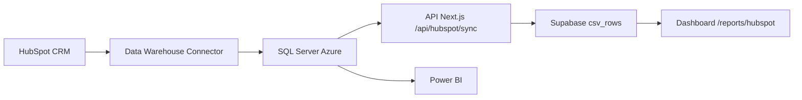

# 🎉 Integração HubSpot Completa!

## ✅ O que foi feito

### 1. 📦 Instalação e Configuração
- ✅ Instalado driver `mssql` para SQL Server
- ✅ Configurado cliente SQL Server em `/src/lib/sqlserver.ts`
- ✅ Variáveis de ambiente adicionadas em `.env.local`

### 2. 🔌 API de Sincronização
- ✅ Criado `/api/hubspot/sync` (POST e GET)
- ✅ Conecta no SQL Server Data Warehouse
- ✅ Importa deals do HubSpot
- ✅ Transforma para formato padronizado
- ✅ Salva no Supabase (`csv_rows` table)

### 3. 📊 Página de Relatório
- ✅ Criado `/reports/hubspot`
- ✅ Dashboard com estatísticas
- ✅ Filtros por descrição, empresa, deal ID
- ✅ Filtros por status (conciliado/pendente)
- ✅ Botão de sincronização manual
- ✅ Exportação para CSV
- ✅ Edição e exclusão de linhas
- ✅ Toggle de status conciliado

### 4. 🧭 Navegação
- ✅ Adicionado "HubSpot Deals" no menu lateral
- ✅ Localização: Cash Management → Payment Channels → HubSpot Deals

### 5. 📚 Documentação
- ✅ Guia completo: `/docs/HUBSPOT-INTEGRATION.md`
- ✅ Setup Vercel: `/docs/VERCEL-ENV-SETUP.md`
- ✅ Script automático: `/scripts/setup-vercel-env.sh`

### 6. 🚀 Deploy
- ✅ Build testado e funcionando
- ✅ Código commitado no Git
- ✅ Push para GitHub (deploy automático iniciado)

---

## 🎯 Próximos Passos

### CRÍTICO: Configurar Variáveis no Vercel

**Opção A - Manual (Recomendado):**
1. Acesse: https://vercel.com/dsdpowerbitutorials/automacao-dados-financeiros/settings/environment-variables
2. Siga o guia: [docs/VERCEL-ENV-SETUP.md](docs/VERCEL-ENV-SETUP.md)

**Opção B - Automático (precisa Vercel CLI):**
```bash
./scripts/setup-vercel-env.sh
```

### Testar a Integração

Após configurar as variáveis:

1. **Aguardar deploy** (2-5 minutos)
2. **Acessar:** `https://seu-dominio.vercel.app/reports/hubspot`
3. **Clicar em "Sincronizar"**
4. **Verificar:** Dados aparecem na tabela

---

## 📋 Estrutura de Dados

### SQL Server (Source)
```
Data Warehouse → Tabela "deals"
├── deal_id
├── deal_name
├── amount
├── close_date
├── stage
├── pipeline
├── owner_name
├── company_name
└── currency_code
```

### Supabase (Destination)
```
csv_rows
├── id (auto)
├── source = 'hubspot'
├── date (close_date)
├── description (deal_name + company)
├── amount
├── reconciled (boolean)
└── custom_data (JSON)
    ├── deal_id
    ├── stage
    ├── pipeline
    ├── owner
    ├── company
    └── currency
```

---

## 🔄 Como Funciona



1. **HubSpot** envia dados para o **Data Warehouse Connector** (pago)
2. **Connector** sincroniza com **SQL Server Azure**
3. **Botão "Sincronizar"** chama API `/api/hubspot/sync`
4. **API** consulta SQL Server e importa dados
5. **Dados** salvos no Supabase (tabela `csv_rows`)
6. **Dashboard** exibe e permite editar/conciliar

---

## 💰 Benefícios

✅ **ROI Máximo** - Reutiliza conector já pago  
✅ **Sem Rate Limits** - Não depende da API HubSpot  
✅ **Dados Validados** - Data Warehouse já normaliza tudo  
✅ **Integração Unificada** - Mesma interface das outras fontes  
✅ **Power BI Continua** - Não interfere com setup existente  

---

## 🔐 Segurança

⚠️ **Importante:**
- Credenciais NÃO foram commitadas (só em `.env.local`)
- `.env.local` está no `.gitignore`
- Configure variáveis no Vercel separadamente
- Rotacione senhas periodicamente

---

## 🐛 Troubleshooting Comum

### 1. Erro de Conexão
**Sintoma:** "Failed to connect to SQL Server"  
**Solução:** Adicionar IPs do Vercel no firewall do Azure SQL

### 2. Tabela "deals" não existe
**Sintoma:** "Invalid object name 'deals'"  
**Solução:** Ajustar nome da tabela na query (linha 19 de `/api/hubspot/sync/route.ts`)

### 3. Dados não aparecem
**Sintoma:** Sincronização OK mas tabela vazia  
**Solução:** Verificar RLS policies do Supabase na tabela `csv_rows`

---

## 📞 Recursos

- 📖 **Docs:** [docs/HUBSPOT-INTEGRATION.md](docs/HUBSPOT-INTEGRATION.md)
- ⚙️ **Setup:** [docs/VERCEL-ENV-SETUP.md](docs/VERCEL-ENV-SETUP.md)
- 🔧 **Código API:** [src/app/api/hubspot/sync/route.ts](src/app/api/hubspot/sync/route.ts)
- 🖥️ **Dashboard:** [src/app/reports/hubspot/page.tsx](src/app/reports/hubspot/page.tsx)
- 🗄️ **Client SQL:** [src/lib/sqlserver.ts](src/lib/sqlserver.ts)

---

## 🎊 Status

| Item | Status |
|------|--------|
| Código | ✅ Completo |
| Build | ✅ Passou |
| Git Push | ✅ Enviado |
| Deploy Vercel | 🔄 Em andamento |
| Vars Ambiente | ⏳ **PENDENTE - Configurar manualmente** |

---

**Última atualização:** 2 Janeiro 2026  
**Commit:** 27d1931  
**Branch:** main
